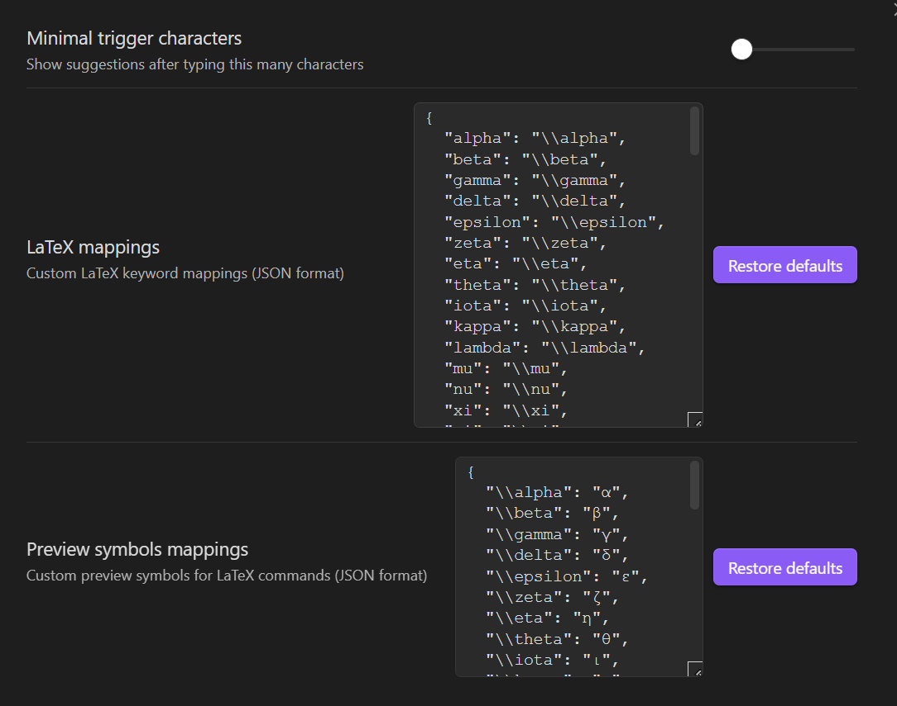

# latex-autocomplete
Custom LaTeX Autocomplete for Obsidian:
This plugin puts you in control, letting you build a fully personalized autocomplete list for any LaTeX formula.

All of them can be customized in the plugin's settings.

### Usage Guide
After installation
1. Place cursor inside $$ / $, then type any character to trigger completion",
2. Use ↑/↓ keys to navigate suggestions, Enter to apply,
3. Press Space to cancel current completion and start new word,

### License
This plugin is licensed under the [MIT License](https://github.com/aiksxd/latex-autocomplete/blob/main/LICENSE).
